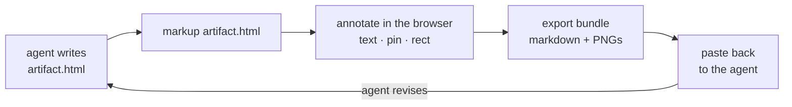

# Markup

Point-and-click annotation layer for reviewing rendered HTML artifacts. Wraps a local HTML file with a browser-based annotation overlay served on localhost, then exports a feedback bundle (markdown + cropped PNG screenshots) ready to hand back to the agent that produced it.

Everything runs on localhost. The page is served by a local Node process, the
overlay talks only to that process, and the source HTML is never modified.
Nothing is uploaded anywhere.


## The loop



Markup closes the review loop for agent-produced HTML: instead of describing
what's wrong ("in the chart section, the caption says..."), you point at it.
The exported bundle carries the exact text, a CSS path to the element, and a
cropped screenshot, so the agent knows precisely what you meant.

## Install

Requires Node 18+.

```bash
git clone https://github.com/johnblythe/markup.git
cd markup
npm install
npm link
```

## Use

```bash
markup path/to/artifact.html
# shorthand for `markup serve path/to/artifact.html`
# opens default browser to localhost:7778 with annotation overlay

markup serve path/to/artifact.html --port 9000
# custom port (flags work with the shorthand too)

markup list
# table of running instances: port, pid, file, started

markup stop path/to/artifact.html
markup stop --port 9000
markup stop --all
# stop one instance (by path or port) or every running instance

markup dash
markup dash --detach
# open the dashboard listing all running instances; --detach (-d) starts it
# in the background, waits until it's up, prints the URL, and returns
```

Try it on the bundled sample report:

```bash
markup examples/demo.html
```

### Ports

`serve` instances start at 7778 and step up on collision. Port 7780 is
reserved for `markup dash` and is skipped by that step-up, so a serve
instance can never take it. `markup dash` binds 7780 strictly and reuses
a live dashboard instead of starting a second one; see `markup dash --help`
for `--reclaim` and `--port` when something else is squatting on 7780.

## Annotation modes

- **Text** (`T`) — select any text, leave a note. Persists as a highlighted span.
- **Highlight** (`H`) — select any text; it's highlighted instantly, no note required. Click an existing highlight to add a note or delete it. Tells the agent: add emphasis here, change nothing else.
- **Strike** (`X`) — select any text; it's struck through instantly, no note required. Click an existing strike to add a reason or remove it. Tells the agent: delete this exact text and repair the surrounding grammar/punctuation.
- **Pin** (`P`) — click any element, drop a numbered pin with a note.
- **Rect** (`R`) — shift-drag (or toggle Rect mode) to draw a rectangle; tool screenshots that region and attaches a note.

Shortcuts are ignored while typing in a text field or the note popover. `Esc` clears the active mode.


## Export

- **Export to clipboard** — copies a markdown payload (with inline PNG data-URIs for rectangles) to clipboard. Paste into Claude Code chat.
- **Export to disk** — writes `<artifact>.feedback.md` and `<artifact>.feedback.assets/*.png` next to the source HTML, then copies the saved `.md` path to clipboard (toast stays clickable to copy again).

The source HTML is never modified.

What the agent gets back (excerpt from a real export of the sample report):

```markdown
# Feedback: demo.html
Total annotations: 5

## Span annotations
- "W10 dips on the release freeze": explain the release freeze inline — readers won't know what froze

## Highlight annotations
- [HIGHLIGHT] "conversion rate improved 12% week over week": (no note)

## Strike annotations
- [DELETE] "as previously mentioned in the earlier section": redundant, already covered above

## Pin annotations
- Pin ① on `td` (body > div:nth-of-type(1) > table > tbody > tr:nth-of-type(3) > td:nth-of-type(2)) — text: "At risk": link the rate-limit decision doc here
```

## Claude Code skill

`skill/SKILL.md` teaches a Claude Code agent to drive this tool: serve the HTML
it just wrote, hand back the URL, and pick up the exported feedback. Install it
by symlinking (so it tracks the repo) or copying:

```bash
ln -s "$PWD/skill" ~/.claude/skills/markup
# or: mkdir -p ~/.claude/skills/markup && cp skill/SKILL.md ~/.claude/skills/markup/
```

Then `/markup` in a Claude Code session serves the last HTML artifact it
produced. `/markup list`, `/markup dash`, and `/markup stop` map to the CLI.

## Contributing

Issues and pull requests welcome. Fork, branch, open a PR. Every change is
reviewed before merge. Please run `npm test` first.
