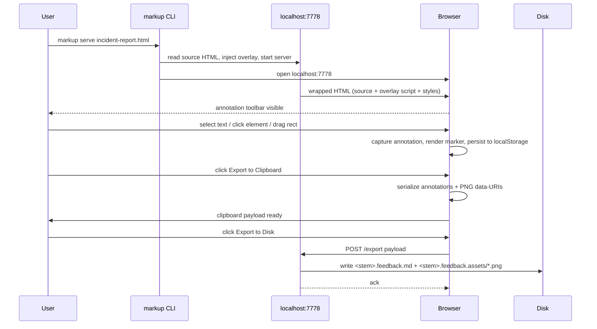

# feat: Markup MVP, Point-and-Click Annotation Tool

**Target repo:** `~/code/markup/` (greenfield)

## Summary

Greenfield Node CLI that wraps a rendered HTML artifact with an annotation overlay served on localhost. MVP delivers all three annotation modes (text-span, element-pin, drag-rect with screenshot), localStorage persistence, and both export paths (clipboard + file-on-disk). Source HTML is never modified. Pattern mirrors Inkwell's `node:http` + `commander` shape; no shared deps with Inkwell.

---

## Origin Document

`docs/brainstorms/2026-05-19-markup-requirements.md`. All R-IDs, A-IDs, F-IDs, AE-IDs referenced below are from that doc.

---

## Problem Frame

User reviews many agent-produced HTML artifacts (incident briefs, dashboards, status reports). Current loop forces manual edits to the source file (which the agent clobbers on regeneration) plus alt-tabbing to a separate screenshot tool to communicate visual feedback. Markup gives the user a single browser surface to leave structured feedback without touching source, then exports a markdown + PNG bundle for any agent to consume.

---

## Scope (MVP boundaries)

MVP is shipped in 6 implementation units (U1 to U6), targeting one focused work session. All MVP units honor F1 (wrap and annotate) and at least one of F2/F3 (both included since they share most plumbing).

Deferred to V2 (same project, post-MVP):
- R10 fuzzy fingerprint re-anchoring with detached sidebar. MVP uses pure CSS-path anchor; on re-render mismatches, annotations show as "detached" via simple string comparison only.
- JSON sidecar (`<stem>.feedback.json`) for round-trip tooling. MVP writes markdown only.
- Theme customization, accessibility polish, keyboard shortcuts beyond essentials.
- Multi-tab annotation of same artifact (single-tab assumption holds).

---

## Output Structure

```
~/code/markup/
├── bin/
│   └── markup.js              # CLI entry (commander)
├── src/
│   ├── serve.js               # localhost HTTP server, static neighbor dir mount
│   ├── wrap.js                # HTML wrapping: inject overlay into source HTML
│   ├── export.js              # markdown + PNG bundle generation
│   ├── client/
│   │   ├── overlay.js         # bootstraps annotation UI on page load
│   │   ├── modes.js           # text-span / pin / rect mode handlers
│   │   ├── popover.js         # annotation note input + display
│   │   ├── fingerprint.js     # CSS-path + content hash for anchors
│   │   ├── persist.js         # localStorage adapter, keyed by artifact path
│   │   ├── screenshot.js      # drag-rect screenshot via modern-screenshot
│   │   ├── export-client.js   # clipboard payload + POST-to-server for disk
│   │   └── styles.css         # overlay UI styles, scoped to .markup-* classes
│   └── client-bundle.js       # build step: bundle client/* into single inline script
├── test/
│   ├── wrap.test.js
│   ├── serve.test.js
│   └── export.test.js
├── docs/
│   ├── brainstorms/
│   │   └── 2026-05-19-markup-requirements.md
│   └── plans/
│       └── 2026-05-19-001-feat-markup-mvp-plan.md (this file)
├── package.json
├── README.md
└── .gitignore
```

The implementing agent may adjust this layout; per-unit `Files` lists are authoritative.

---

## High-Level Technical Design

*Directional guidance for review, not implementation specification.*



**Wrapping strategy** — `wrap.js` reads the source HTML as a string, locates `</body>` (or `</html>` as fallback), and injects two `<script>` tags before it: one for the bundled client (overlay UI + mode handlers + persist), one for the modern-screenshot library. Injects one `<style>` block in `<head>` (or document start) for overlay styles. Source HTML is mutated in memory only and served from the server, never written back.

**Static asset mount** — server serves the parent directory of the source HTML as static root so the source's relative paths (``, `<link href="./styles.css">`) resolve. Overlay's own assets live under `/__markup/` namespace to avoid collisions.

**Anchor strategy** — each annotation stores a CSS-path (e.g., `body > main > section:nth-of-type(2) > p:nth-of-type(3)`), the element's textContent first 80 chars, the tagName, and (for rect mode) bounding-rect coords relative to the element. On reload, anchors resolve by CSS-path first; if that fails, by tag + textContent match. MVP does NOT implement fuzzy re-anchor on source changes; if CSS-path resolves on reload (same source unchanged), annotations re-attach cleanly. R10 detached sidebar is V2.

---

## Key Technical Decisions

- **`modern-screenshot` over html2canvas for drag-rect rasterization.** Better SVG support (uses foreignObject), modern API, smaller bundle. Incident-brief charts are inline SVG, which html2canvas mishandles. Rationale documented in origin's "Deferred to Planning" Q1.
- **Bundle client-side code as inline `<script>` injected into wrapped HTML, not separate files.** Avoids cross-origin issues with `file://` references and keeps wrapping idempotent and self-contained. Build step at server-start time, not at install time, so dev iteration is fast.
- **`commander` for CLI, mirroring Inkwell.** Familiar shape; trivial dependency.
- **`node:http` directly, no express.** Inkwell pattern; only two endpoints needed (`GET /` and `POST /export`).
- **Browser auto-launch via the `open` npm package**, not raw shell invocation. (`open` uses `execFile` internally and handles cross-platform safely.)
- **`localStorage` keyed by absolute source path.** Same approach as Inkwell. No server-side state. Survives reload, scoped per artifact.
- **Both export paths in MVP, not just one.** They share most of the code; splitting them adds nothing.
- **Rect-mode trigger: both shift-drag (anywhere, always-on power-user gesture) AND toolbar toggle (discoverable button).** Origin's open question Q7 resolved both-ways.
- **Pin numbering: monotonic per-artifact counter persisted in localStorage.** Pins display as `①②③` numbered badges, z-index 99999, absolutely positioned to top-left of anchor element's bounding rect.
- **Default port 7778** (origin Key Decision; Inkwell uses 7777).
- **No JSON sidecar in MVP.** Markdown export is the source of truth for V1; JSON deferred.
- **Tool name stays "markup"** working name through MVP; rename if user prefers after toying with it.

---

## Implementation Units

### U1. Project scaffold and CLI entry

**Goal:** Greenfield `~/code/markup/` project with `package.json`, `bin/markup.js` CLI entry exposing `serve` command, and minimal directory structure ready for U2-U6.

**Requirements:** R1, R2, R3 (CLI surface).

**Dependencies:** none.

**Files:**
- `package.json` (deps: `commander`, `modern-screenshot`, `open`)
- `bin/markup.js` (commander setup, `serve <file>` subcommand with `--port` option)
- `.gitignore` (`node_modules/`, `*.feedback.md`, `*.feedback.assets/`, `tmp/`)
- `README.md` (one-paragraph blurb + usage example)
- `src/serve.js` (stub: exports `startServer(filePath, opts)` returning a Promise)
- `test/wrap.test.js` (placeholder using `node --test`)

**Approach:** Mirror Inkwell's `bin/inkwell.js` shape. CLI parses args, validates file path exists, delegates to `startServer`. Use Node 18+ built-ins; no transpilation.

**Patterns to follow:** `~/code/writing-den/tools/inkwell/bin/inkwell.js`, `~/code/writing-den/tools/inkwell/package.json`, `~/code/writing-den/tools/inkwell/src/serve.js` (header pattern).

**Test scenarios:**
- `markup serve <path>` with a non-existent path exits with non-zero status and a clear error message including the path.
- `markup serve --port 9000 <path>` parses the port flag and forwards it to `startServer` opts.
- `markup --help` prints usage including the `serve` subcommand.

**Verification:** `node bin/markup.js serve /tmp/test.html` (after `touch`ing the file) successfully invokes `startServer` (stub) without crashing.

---

### U2. HTML wrapping and serving

**Goal:** `markup serve <file.html>` reads the HTML, injects overlay script + style placeholders, serves on localhost, mounts the source's parent dir for relative-asset resolution, opens default browser.

**Requirements:** R1, R2, R3, R11 (non-mutation).

**Dependencies:** U1.

**Files:**
- `src/serve.js` (full implementation)
- `src/wrap.js` (HTML string transformation)
- `test/wrap.test.js` (wrap function tests)
- `test/serve.test.js` (server tests via `node:http` client)

**Approach:**
- `wrap.js` exports `wrapHTML(rawHTML, clientBundleSrc, stylesheetSrc)`. Inserts `<style>` after `<head>` open tag (or prepends if no `<head>`). Inserts `<script>` before `</body>` close (or appends if no `</body>`). Returns mutated string. Idempotent; does NOT re-inject if `data-markup-wrapped="true"` marker exists.
- `serve.js` exports `startServer(filePath, opts)`. Routes:
  - `GET /` → wrap and serve source HTML
  - `GET /__markup/client.js` → bundled client code
  - `GET /__markup/modern-screenshot.js` → vendored or `node_modules`-pulled lib
  - `GET /__markup/styles.css` → overlay stylesheet
  - `GET /*` → static-serve from `path.dirname(filePath)` (404 if outside that dir, no `..` traversal)
  - `POST /export` → handled in U6
- Opens browser via the `open` npm package (`await open(url)`).

**Patterns to follow:** Inkwell `serve.js` for HTTP routing shape, MIME-type table, static-file serving with path-traversal guards.

**Test scenarios:**
- `wrapHTML` injects script and style markers exactly once even if called twice on the same string.
- `wrapHTML` handles HTML with no `<head>` (prepends style) and no `<body>` (appends script).
- `startServer` resolves with `{port, server, sourceHTML}` and the server responds 200 to `GET /` with wrapped HTML containing both injection markers.
- `GET /__markup/client.js` returns the client bundle with `Content-Type: application/javascript`.
- `GET /../etc/passwd` returns 403 or 404; no path traversal escapes the source dir.
- Concurrent `GET /` requests don't interleave or corrupt the wrap output.
- Source HTML file on disk is byte-identical before and after a serve session (R11 verified at file-mtime level).

**Verification:** Run `markup serve <path-to-real-html>`, browser opens to localhost:7778, page renders with source content visible AND a `<div id="markup-toolbar">` element present in the DOM (toolbar shell from U3 will populate it; U2 just injects the mount point).

---

### U3. Overlay UI shell (toolbar, popover, persistence plumbing)

**Goal:** Client-side UI shell that renders a floating toolbar (mode buttons, export buttons) and a popover component for note entry. Wires up localStorage adapter keyed by source file path. No annotation mode logic yet (lands in U4-U6).

**Requirements:** R7, R8, R9 (persistence + export surface).

**Dependencies:** U2.

**Files:**
- `src/client/overlay.js` (bootstrap, mounts toolbar + popover into DOM)
- `src/client/popover.js` (textarea + save/cancel buttons, positioned absolutely)
- `src/client/persist.js` (localStorage adapter: `loadAnnotations(key)`, `saveAnnotation(key, anno)`, `deleteAnnotation(key, id)`, `clearAll(key)`)
- `src/client/styles.css` (toolbar, popover, mode-active, pin-badge, rect-overlay styles, all scoped to `.markup-*` and `#markup-*` selectors)
- `src/client-bundle.js` (Node-side: concatenates `client/*.js` into a single IIFE string; serves as `/__markup/client.js`)
- `test/wrap.test.js` (add: bundle includes all client modules)

**Approach:**
- Toolbar is a fixed-position div at bottom-right (mirroring Inkwell's export button position). Buttons: `Text`, `Pin`, `Rect`, `Export → clipboard`, `Export → disk`, `Clear all`.
- Popover is a single shared element repositioned per annotation. Contains textarea, Save button, Cancel button. Shown by mode handlers, dismissed on save/cancel/escape.
- Persistence key is the absolute source path passed into the page via `window.__MARKUP_KEY__` injected by the server during wrap. Format: `markup:annotations:/Users/.../incident-report.html` → JSON array of annotation objects.
- Annotation shape:
  ```
  {
    id: "anno-<uuid-v4-ish>",
    mode: "span" | "pin" | "rect",
    createdAt: ISO8601,
    note: string,
    anchor: { cssPath, tagName, textHash, role?, ariaLabel? },
    payload: {
      // span: { startOffset, endOffset, anchorText }
      // pin: {}  (just uses anchor)
      // rect: { x, y, w, h, pngDataURL }
    }
  }
  ```

**Patterns to follow:** Inkwell's `annotate.js` for client-side annotation lifecycle, debouncing, and event delegation patterns.

**Test scenarios:**
- `client-bundle.js` produces a single string with no `require` or `import` statements at the top level (browser-safe).
- `persist.js` round-trips an annotation: save then load returns the same object.
- `persist.js` keyed by two different paths keeps annotations isolated.
- Toolbar renders into a fresh DOM and is positioned visibly without overlapping the page's bottom-right corner content (CSS z-index 99999).
- Manual: open served page, see toolbar, click each mode button (no-op for now but visual feedback shows which mode is active).

**Verification:** Browser shows toolbar with all 5 buttons. Clicking a mode button toggles the active state visually. Reloading the page with an annotation in localStorage shows the popover-readable annotation count somewhere visible (e.g., "3 annotations" indicator in toolbar).

---

### U4. Text-span annotation mode

**Goal:** User selects text in the artifact; popover appears anchored to selection; on save, selection is wrapped in a visible `<mark>` with a click-to-edit/delete handle. Persists via U3.

**Requirements:** R4 (text-span mode), R7 (persistence), AE1.

**Dependencies:** U3.

**Files:**
- `src/client/modes.js` (text-span handler — first of three; pin/rect land in U5/U6)
- `src/client/fingerprint.js` (CSS-path generator, text-hash)

**Approach:**
- Mode entered via toolbar "Text" button. Mouse selection in document creates a Range; on mouseup, if range non-empty, show popover near range bounding rect.
- On save: compute CSS-path of common ancestor, store startOffset/endOffset relative to that ancestor's textContent, snapshot anchorText (first 80 chars). Wrap range in `<mark class="markup-span" data-anno-id="...">`. Push to persist.
- On load (reload): for each persisted span annotation, resolve cssPath → element, walk text nodes by offset, wrap in `<mark>`. If resolution fails: skip silently in MVP (V2: detached sidebar).
- Click an existing `<mark>` opens popover with note text + Edit/Delete buttons.

**Patterns to follow:** Inkwell `annotate.js` paragraph-comment lifecycle (load, hydrate, delete). Use `Range.cloneRange()` and `surroundContents` patterns; fall back to manual splitting for ranges spanning elements.

**Test scenarios:**
- *Covers AE1.* Selecting "p90 close clips at 30d ceiling" in a served page, opening popover, writing "explain this ceiling inline" and saving causes that text to render with a `<mark class="markup-span">` wrap, AND on full page reload the mark is still there with the same note.
- Selecting across two paragraphs (multi-element range) saves successfully and renders marks on both fragments (may show two marks; that's fine).
- Empty selection (just a click) does NOT open the popover.
- Deleting a span annotation removes the `<mark>` wrap and clears it from localStorage.
- CSS-path generator produces a deterministic path for the same element across multiple calls.
- `fingerprint.js` text-hash collapses whitespace and lowercases before hashing, so trivial whitespace edits don't break re-anchor.

**Verification:** Manual: serve the incident-brief HTML, select the same paragraph twice, refresh, see both marks; click one, edit the note, see update persist.

---

### U5. Element-pin annotation mode

**Goal:** User toggles Pin mode; next click on any element drops a numbered pin badge at its top-left; popover appears for note. Persists. Clicking an existing pin reopens its note.

**Requirements:** R5 (element-pin mode), R7, AE3 (chart-region anchor robustness).

**Dependencies:** U4 (modes.js infrastructure, fingerprint).

**Files:**
- `src/client/modes.js` (extend with pin handler)

**Approach:**
- Mode entered via toolbar "Pin" button. Cursor changes to crosshair. Next click is captured at document level (capture phase, preventDefault), the target element is recorded.
- Compute fingerprint (cssPath + tagName + textHash + role/aria when present). Render a fixed-position numbered badge (`<div class="markup-pin" data-anno-id="..." data-pin-num="N">N</div>`) positioned via `getBoundingClientRect()` + scroll offset; re-position on window scroll/resize.
- Save: persist with anchor only (no payload). Popover near badge.
- Click badge → reopen popover; Edit / Delete supported.
- On load: for each pin annotation, resolve cssPath, render badge. If unresolved, skip silently (MVP).

**Patterns to follow:** None in Inkwell; this is net new. Use standard `getBoundingClientRect` + `window.scrollY` / `scrollX` for positioning.

**Test scenarios:**
- Toggling Pin mode then clicking a chart `<svg>` element drops a pin badge at the SVG's top-left, and a popover appears.
- The pin badge's number increments per artifact (first pin = 1, second = 2, etc.).
- Reloading the page with two pin annotations renders both badges at the correct positions for their anchor elements.
- Resizing the window or scrolling repositions pin badges so they stay anchored to their elements.
- Clicking an existing pin badge does NOT drop a new pin; it opens the existing one's popover.
- Clicking outside Pin mode (mode not toggled) does not drop a pin.
- *Covers AE3 (partial).* If the source HTML is regenerated with the chart element kept (same `<svg>` cssPath) but caption rewritten, reloading after the regenerate keeps the pin on the chart even though the caption text changed.

**Verification:** Manual: serve incident-brief, toggle Pin, click the bar chart, leave a note, refresh, pin still there at correct position. Click the pin, edit the note, see update.

---

### U6. Drag-rectangle mode + screenshot + export bundle

**Goal:** Shift-drag (always) or Rect-mode toggle + drag draws a rectangle on the page, screenshots the region via modern-screenshot, opens popover. Saves rect as anchor + cropped PNG. Both export paths (clipboard with data-URIs, disk with PNG files) implemented.

**Requirements:** R6 (drag-rect), R8 (disk export), R9 (clipboard export), R11 (no source mutation), AE2, AE4, AE5.

**Dependencies:** U3 (export buttons), U4-U5 (modes infrastructure).

**Files:**
- `src/client/modes.js` (extend with rect handler)
- `src/client/screenshot.js` (modern-screenshot wrapper, crop helper)
- `src/client/export-client.js` (markdown serializer, clipboard path, POST-to-server path)
- `src/export.js` (server side: receive POST /export, write `<stem>.feedback.md` and `<stem>.feedback.assets/*.png`)
- `test/export.test.js` (server export endpoint tests)

**Approach:**
- Rect-mode trigger: either Rect toolbar toggle, OR shift-mousedown anywhere when no other mode active. Draw a live rectangle outline (`<div class="markup-rect-draft">`) during drag. On mouseup, if rect area > 8x8px:
  1. Call `modernScreenshot.domToPng(document.body, { backgroundColor: null })` to rasterize the whole page (cached for the session).
  2. Crop the rasterized PNG to rect bounds via off-screen canvas, output PNG dataURL.
  3. Show popover near rect; on save, persist `{ anchor, payload: { x, y, w, h, pngDataURL } }`. Anchor = element under rect center.
  4. Render persistent rect outline (`<div class="markup-rect">`) at rect coords; click to reopen popover.
- **Export to clipboard** (`Export → clipboard` button):
  1. Build markdown payload (template below).
  2. For rect annotations, inline ``.
  3. `navigator.clipboard.writeText(payload)`.
  4. Toast: "Copied N annotations".
- **Export to disk** (`Export → disk` button):
  1. Build payload (same markdown), but rect images referenced as relative paths: ``.
  2. POST to `/export` with `{ markdown, assets: [{ filename, dataURL }, ...] }`.
  3. Server (`src/export.js`) decodes dataURLs to buffers, writes PNGs to `<stem>.feedback.assets/` (create dir, clobber existing files for idempotent re-exports), writes `<stem>.feedback.md`.
  4. Toast: "Wrote to <path>".

Markdown payload template:
```markdown
# Feedback: <source-filename>
Reviewed: <ISO8601-date>

## Span annotations
- (anno-id) anchor: "<first 60 chars of anchor text>...": <note>

## Pin annotations
- Pin ① on `<tagName cssPath>`: <note>
- Pin ② on `<tagName cssPath>`: <note>

## Rect annotations
- Rect 1 on `<tagName cssPath>`:
  <note>
  
```

**Patterns to follow:** Inkwell `serve.js` `handlePost` pattern for POST handling, file write with `uniquePath` collision handling.

**Test scenarios:**
- *Covers AE2.* Shift-dragging a rectangle around a chart region, writing "fill in May 11 and May 18 weeks", saving, then reloading the page renders the rect outline at the same coords with the same note. The persisted annotation contains a `pngDataURL` field with a non-empty base64 string.
- *Covers AE4.* With three annotations of mixed mode in localStorage, clicking `Export → clipboard` writes a clipboard payload that contains all three notes, AND for rect annotations contains a `data:image/png;base64,` reference. Clicking `Export → disk` writes both `<stem>.feedback.md` and `<stem>.feedback.assets/rect-1.png` to disk; the markdown references the relative path; the file exists and has size > 0.
- *Covers AE5.* After a full annotation + export-to-disk session including rect screenshots, the source HTML file's mtime and SHA256 are unchanged from before the session (R11 verified at hash level).
- Rect under 8x8 pixels is treated as a click (no rect drawn, no screenshot taken).
- Re-exporting after edits clobbers prior `.feedback.md` and assets (idempotent overwrite).
- POST /export rejects requests for files outside the source's parent dir (path traversal guard).
- POST /export rejects payloads above 50MB (size guard).
- modern-screenshot fallback: if rasterization throws (rare; some pages with `tainted` canvas), the rect annotation saves with note + coords but no PNG, and the markdown payload shows a placeholder `[screenshot unavailable: <reason>]` instead of an image link.

**Verification:** Manual full pass: serve incident-brief, leave one of each annotation type (text-span on caption, pin on chart, rect on chart region with screenshot), export to clipboard (paste into a scratch buffer to confirm contents), export to disk (verify `<stem>.feedback.md` and PNG exist with sensible content). Refresh page, all three annotations still visible. Run `shasum` on the source HTML before and after the session, hashes identical.

---

## Deferred to Follow-Up Work

These are post-MVP work-items for the same project, tracked here so they don't get lost. They are NOT part of the MVP scope and NOT to be implemented by `ce-work` in this session:

- **R10 fuzzy fingerprint re-anchor + detached sidebar.** When source HTML is regenerated and an annotation's cssPath no longer resolves, today they silently skip render. V2: surface them in a "Detached annotations" sidebar with the original note, screenshot if rect, and original anchor text; allow user to manually re-anchor by clicking a new target.
- **JSON sidecar export** (`<stem>.feedback.json`) for tools that want structured round-trip.
- **Theming**: dark mode, font customization.
- **Keyboard shortcuts**: `T` for text mode, `P` for pin, `R` for rect, `E` for export, `Esc` to dismiss popover.
- **Inline-asset compression** for clipboard exports when total payload exceeds ~2MB (downscale rects automatically).
- **Multi-tab safety**: detect another tab annotating the same artifact, warn user.
- **`markup open` static mode** (no server, clipboard-only, mirrors Inkwell's static mode).
- **`markup --watch`** mode that auto-reloads when source HTML changes on disk.
- **Mac menu-bar widget / system-wide overlay (V3, ambitious).** A native macOS companion that sits alongside any app — Cursor, Linear, Slack, Notion in Chrome, a PDF in Preview — and lets the user invoke the same three annotation modes (text-span on selected OS-level text, point-pin via cursor position, drag-rectangle via system-wide screen capture) without a browser at all. Output bundle stays the same shape (`.feedback.md` + cropped PNGs) so the agent handoff is identical regardless of surface. Implementation likely Swift + ScreenCaptureKit + Accessibility API for text-span; substantial scope (codesign, notarization, permissions UX, multi-monitor handling). Treat as a sibling product that shares the export format with this CLI, not a feature of the CLI itself. The dream is: review anything on screen anywhere, same primitive, same bundle out.

---

## Risks and Mitigations

- **Risk: modern-screenshot fails on inline SVG with external references (e.g., gradient defs referenced by url(#id)).** Mitigation: tested with the incident-brief artifact (canonical use case); fallback to "screenshot unavailable" placeholder in the export markdown if it throws.
- **Risk: clipboard payload too large to paste into Claude Code chat for large rect screenshots.** Mitigation: out of scope for MVP (deferred to compression work). MVP will warn in toast if payload > 5MB.
- **Risk: CSS-path anchor breaks on minor source structural edits (e.g., wrapping a div).** Mitigation: V2 fuzzy fingerprint. MVP scope is the same-source review session; cross-regenerate persistence is not promised.
- **Risk: `file://` protocol gotchas if user tries to drag an `.html` file directly into a browser.** Mitigation: tool always serves via localhost; document this explicitly in README.
- **Risk: source HTML's CSP `meta` blocks injected inline scripts.** Mitigation: rare for locally-rendered artifacts; if it happens, document workaround (strip CSP meta during wrap, behind a flag).

---

## Scope Boundaries

Carried from origin doc `docs/brainstorms/2026-05-19-markup-requirements.md` §Scope Boundaries.

### Deferred for later (post-MVP, same project)

See "Deferred to Follow-Up Work" above.

### Outside this product's identity (never)

- Hosted / remote URL annotation. Bookmarklet-shaped product, separate tool.
- Multi-reviewer / collaborative annotation. GitHub or hosted comment systems.
- Inline source editing from overlay. Mutation belongs to producing agent.
- Markdown ingestion. Use `/render` or Inkwell to produce HTML first.
- Code or PR review. GitHub native.
- Browser-harness / CDP coupling.
- Shared package with Inkwell.

---

## Dependencies and Prerequisites

- Node 18+ (built-in `node:http`, fetch, etc.).
- npm packages: `commander@^12`, `modern-screenshot@^4`, `open@^10`.
- macOS `open` command (already in user env) for browser auto-launch (via `open` npm package which abstracts it safely).
- Default browser available.

---

## Verification (Whole-MVP)

The MVP is complete when, with one terminal command (`markup serve <path-to-any-html>`), the user can:

1. Open the browser and see the artifact with a working toolbar.
2. Highlight a phrase, write a note, save it; refresh and see it persist.
3. Toggle pin mode, click a chart, write a note, save it; refresh and see the pin at the same spot with the same note.
4. Shift-drag a rectangle around a chart region, write a note, save it; refresh and see the rect outline.
5. Click "Export to clipboard", paste into a scratch buffer, see structured markdown with all three notes plus a data-URI for the rect screenshot.
6. Click "Export to disk", see `<stem>.feedback.md` and `<stem>.feedback.assets/rect-1.png` written to disk.
7. Verify source HTML file is byte-identical to before the session.

---

## Outstanding Questions (Deferred to Implementation)

- Pin numbering across re-exports: keep monotonic across all-time annotations or reset per-export? (Suggest: monotonic per-artifact, never reset; surface as `①②③…`.)
- Whether the `<mark>` for span annotations should use the same accent color as the pin badges or a distinct color. (Suggest: same accent for unity; revisit if it conflicts visually with the artifact's own colors on common docs.)
- README scope for MVP — minimal "install + run" vs full feature matrix. (Suggest: minimal in MVP, expand as features land.)
